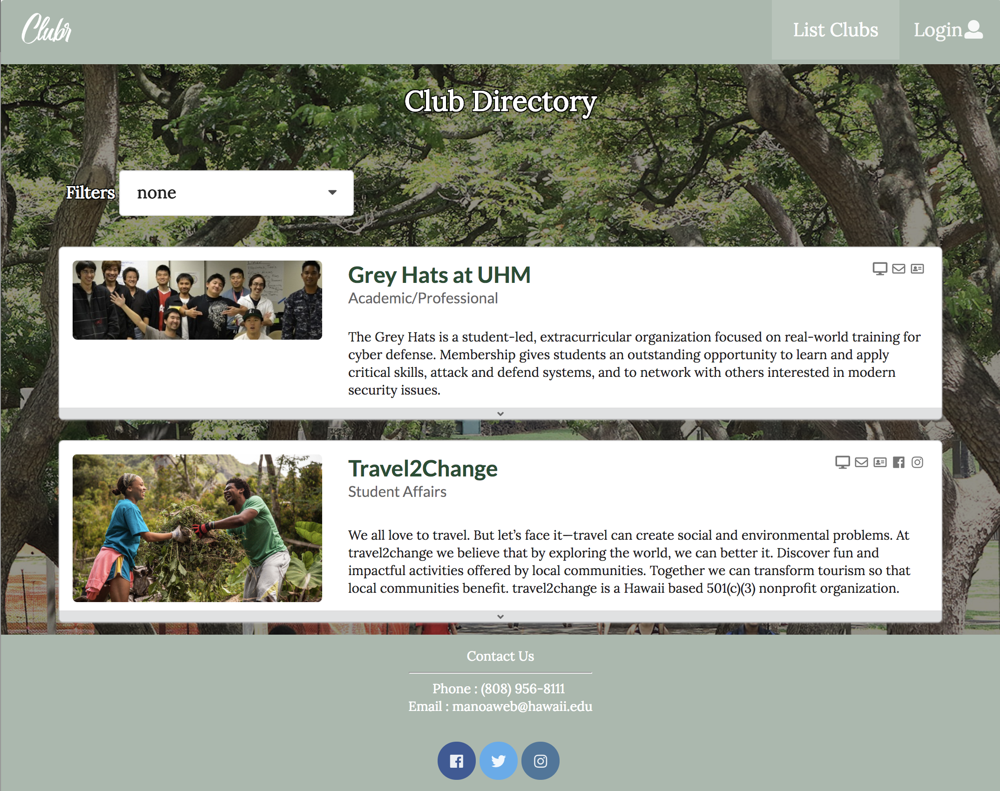

  
  

My final project for ICS 314 Software Engineering course at the University of Hawai’i at Manoa was to develop a website that addressed a particular problem on campus. My team consisted of myself, Sophia Kim, Tysen Imai-Toyoma and Chris Nishimura. Together, we developed UH Clubr-- a web application that takes inspiration from Instagram and Tinder to provide a visual, fun platform for students to get to know clubs on campus and find ones that match with their interests and personality. 

  
  

### More than just a directory
When our group first got together to develop the concept of our website, we found that the only consolidated platform for students to find information about clubs at UH was a link to a spreadsheet. We knew that we wanted to present this information in a website with a better user experience and where designated club members could edit their own information and have a master admin grant access to those individuals. I proposed that we take the website one step further. I thought that we could appeal to the humor of college students by naming the site UH Clubr as a play on ‘Tinder’, Grindr’ and using our website to go ‘clubbing’. I also saw the potential of using Instagram and Tinder as models of how college students today process information and get to know people. 

With Instagram and Tinder in mind, I developed the list clubs page that displayed all of the clubs at UH Manoa  and the club component that provided a model for how each club would be shown.  Students would be able to scroll through this page and see basic information for each club including a photo, name, description, category and social media links which is similar to the Instagram homepage. When you click on the drop down for a club, you can get to know a club through a Tinder-like experience. You would scroll through photos that portray different aspects of the club and ‘first date’ type questions that show its personality as shown in the screenshots above. College students today have a different way of getting to know people, which I believe also extended to organizations. As a result, we have developed this website that displays the UH club directory with a user experience that most appeals to our target audience. This website is a club directory that appeals to our target audience. 

### Team work is the dream work
In the three weeks our team spent together collaborating on this project, I learned a lot about the best practices for optimal team productivity and project management. For one, I found that Discord was a very useful online communication tool that helped organize conversations and team work when working remotely. However, I also found that we were the most productive when we were all physically present. In the future, I would make a bigger effort to distinguish between ‘work times’ and ‘meeting times’. Both are very useful but we could be more conscious of making time to look at the project as a whole, discuss our goals and get help from each other rather than just working on our own. With regards to project management, this was a great opportunity to experience what it’s like to work on a project that lasts longer than a week. I’m glad that I learned to break the project into milestones and break that down into two issues per person per week. This made the idea of a big project seem less overwhelming, keep everyone accountable and make consistent progress throughout the week. 

To learn more about our UH Clubr web application, check out our deployed <a href="http://uhclubr.meteorapp.com">website</a>, <a href="https://uh-clubr.github.io/">github.io page</a> or <a href="https://github.com/uh-clubr/uh-clubr">github repository</a>. Happy reading!
